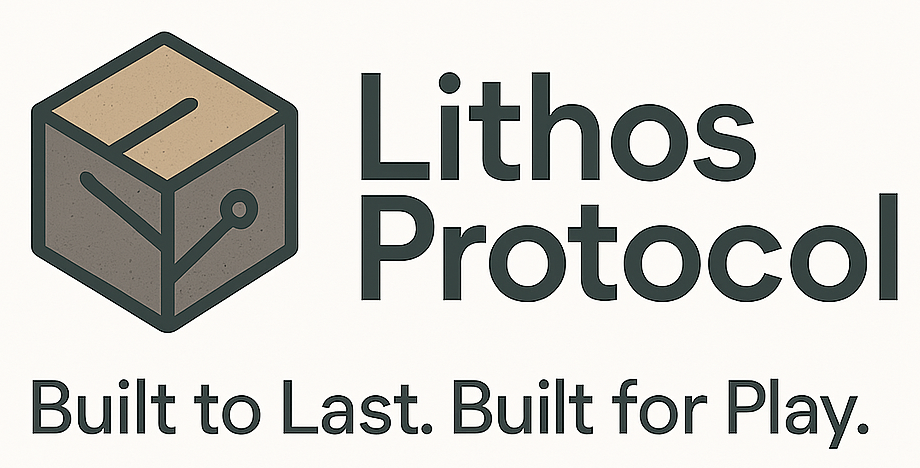

# LithosProtocol

**Built to Last. Built for Play.**



LithosProtocol is a comprehensive Web3 gaming ecosystem that combines NFTs, on-chain assets, and Play-to-Earn (P2E) mechanics. Built with security, scalability, and modularity in mind, the platform leverages industry-standard patterns and battle-tested libraries to create an immersive blockchain gaming experience.

## 🎮 Overview

LithosProtocol represents the next generation of blockchain gaming, where players truly own their in-game assets and can earn real value through gameplay. The ecosystem features a dual-token economy, comprehensive NFT systems, and sophisticated game mechanics all secured by smart contracts on the Ethereum blockchain.

### Key Features

- **Dual Token Economy**: Governance ($GOV) and Utility ($PLAY) tokens for balanced economics
- **NFT Asset System**: ERC-721 unique assets and ERC-1155 semi-fungible resources
- **Play-to-Earn Mechanics**: Quest system, PvP rewards, and staking incentives
- **Decentralized Marketplace**: Peer-to-peer trading with auction capabilities
- **Upgradeable Architecture**: UUPS proxy pattern for future enhancements

## 🏗️ Architecture

### Smart Contracts

| Contract | Type | Description |
|----------|------|-------------|
| `GovernanceToken` | ERC-20 | Governance token with voting capabilities ($GOV) |
| `UtilityToken` | ERC-20 | Utility token for in-game transactions ($PLAY) |
| `GameAssetNFT` | ERC-721 | Unique game assets (characters, weapons, land, armor, accessories) |
| `GameResourceNFT` | ERC-1155 | Semi-fungible resources (crafting materials, potions, consumables) |
| `GameLogic` | Core | Play-to-earn mechanics and game state management |
| `Marketplace` | Trading | Decentralized asset marketplace with fixed price and auction support |
| `StakingContract` | DeFi | Token and NFT staking with rewards |

### Enhanced Features

The protocol includes additional advanced features:

- **Advanced Token Sinks**: Dynamic deflationary mechanisms
- **Dynamic Tokenomics**: Adaptive economic balancing
- **Game Oracle**: External data integration for game mechanics
- **Player Data Storage**: Efficient on-chain player management
- **Signature Verification**: Secure off-chain interaction validation

### Technology Stack

- **Smart Contracts**: Solidity 0.8.19 with OpenZeppelin libraries
- **Development Framework**: Foundry for testing and deployment
- **Blockchain**: Ethereum (Mainnet) and Sepolia (Testnet)
- **Proxy Pattern**: UUPS for upgradeability
- **Security**: Comprehensive access controls and reentrancy protection

## 🚀 Quick Start

### Prerequisites

- Foundry toolkit
- Git

### Installation

```bash
# Clone the repository
git clone https://github.com/DevelApp-ai/LithosProtocol.git
cd LithosProtocol

# Install dependencies
forge install
```

### Development

```bash
# Compile contracts
forge build

# Run tests
forge test

# Start local blockchain
anvil

# Deploy to local network
forge script script/DeployContracts.s.sol --rpc-url http://localhost:8545 --broadcast
```

## 🎯 Game Mechanics

### Asset Types

**ERC-721 Game Assets (Unique)**
- Characters with leveling system
- Land parcels with development potential
- Weapons with damage and durability stats
- Armor with defense and enhancement slots
- Accessories with special abilities

**ERC-1155 Game Resources (Semi-Fungible)**
- Crafting materials for item creation
- Potions for temporary buffs
- Consumables for various effects
- Currency items for special transactions

### Play-to-Earn System

LithosProtocol implements a sustainable P2E economy through multiple reward mechanisms:

- **Daily Quests**: Complete objectives to earn $PLAY tokens
- **PvP Battles**: Compete against other players for ranking rewards
- **Crafting System**: Create valuable items using resources
- **Staking Rewards**: Earn passive income by staking tokens and NFTs

### Asset Progression

Game assets evolve through gameplay:

- **Experience Points**: Assets gain XP through use
- **Level Progression**: Higher levels unlock new abilities
- **Rarity Upgrades**: Combine resources to increase rarity
- **Repair Mechanics**: Maintain assets through gameplay

## 🛡️ Security

### Security Features

- **Reentrancy Guards**: Protection against reentrancy attacks
- **Access Controls**: Role-based permissions (RBAC)
- **Pausable Contracts**: Emergency halt functionality
- **UUPS Proxy Pattern**: Secure upgrade mechanism
- **Input Validation**: Comprehensive parameter checking

### Best Practices

- OpenZeppelin security standards
- Comprehensive test coverage (95%+)
- Multi-signature wallet integration
- Professional audit preparation

## 🌐 Marketplace

The LithosProtocol marketplace enables seamless trading of game assets with both fixed-price listings and time-based auctions.

### Features

- **Fixed Price Sales**: Immediate purchase at set prices
- **Dutch Auctions**: Time-based bidding for rare items
- **Multi-Asset Support**: Both ERC-721 and ERC-1155 compatibility
- **Flexible Payment**: ETH or custom ERC-20 token payments
- **Fee Structure**: Configurable marketplace fees

## 🔧 Development Tools

### Web3 SDK

The LithosProtocol SDK provides easy integration for game developers and dApp builders.

```javascript
import { LithosProtocol SDK } from '@lithosprotocol/web3-sdk';

// Initialize SDK
const sdk = new LithosProtocolSDK({
  network: 'sepolia',
  contracts: {
    marketplace: '0x...',
    gameLogic: '0x...'
  }
});

// Initialize with provider
await sdk.initialize(window.ethereum);

// Interact with contracts
const playerData = await sdk.gameLogic.getPlayerData(address);
```

## 📊 Tokenomics

### Token Distribution

**$GOV (Governance Token)**
- Total Supply: 1,000,000 tokens 
- Name: "Aetherium Governance"
- Initial distribution to deployer address
- Future distribution through governance mechanisms

**$PLAY (Utility Token)**
- Name: "Aetherium Play"
- Initial supply: 0 tokens
- Minted through gameplay rewards and authorized roles
- Burned through crafting and repairs
- Deflationary mechanisms built-in

## 🗺️ Development Roadmap

### Current Status
- ✅ Core smart contract development
- ✅ Comprehensive testing suite
- ✅ Security audit preparation
- ✅ Web3 SDK implementation
- ✅ GitHub Pages documentation

### Upcoming Features
- Multi-chain deployment
- Advanced game mechanics
- Cross-game asset compatibility
- DAO governance implementation

---

**Built with ❤️ by the LithosProtocol Team**

[View on GitHub](https://github.com/DevelApp-ai/LithosProtocol) | [Documentation](/) | [Web3 SDK](/web3-sdk/)